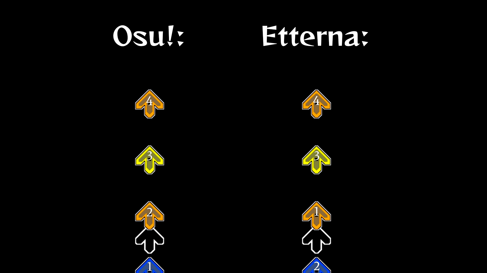

Osu! scoring system and gameplay in etterna:

1. Note priority is the same as in osu!. Priority determines the order in which notes are accepted. In Etterna, the closest note to the receptor is accepted first, in osu! - the oldest and not missed one.
<h1 align="center">Simple visual explanation:</h1>

    

The numbers on this image indicate the order in which notes will be judged.

2. Accuracy scoring is exactly like ScoreV1 in osu!, however osu! points are not implemented yet!

3. Long notes behave as if ScoreV2 is enabled in osu! (1 long note - 2 grades)

4. Timing windows correspond to osu! timing windows. You can choose from OD0 to OD10, and also enable HardRock.

5. HP system remains the same as in Etterna. Default is Life2.

6. Combo breaks only appear if you miss a note.

7. Hidenote Judgment is set to Miss by default. Hidenote Judgment function determines at which grades a note will disappear after being hit. If set to Miss, the note will only disappear if you miss it, otherwise it will continue to travel down the lane.

Some features that are not present in Etterna were also added. For example: customizable backgrounds for all charts, song intro skip.

-----------------------------------

IMPORTANT:

Do not use "Save" and "Cache" folder from Etterna if you don't know what you are doing. 

You are unable to submit scores to etternaonline with this client. 

Do not compare your scores from this client with scores from original Etterna client, at the moment there is no way to accurately recalculate the score.

The latest version is always recommended for use unless stated otherwise on the release page. Scores set in older versions may be broken in newer ones.

-----------------------------------

Please note that this client is still in development and far from perfect! 

If you encounter any bugs, chances are I am aware of them but have not yet figured out how to fix them (or simply just didn't feel like it). 

For example, now I am using ScoreV2 Long Notes because I don't know how to implement ScoreV1 Long Notes without encountering numerous issues.

If you have any questions regarding this client, please do not ask them on the Etterna discord server. Nobody is obligated to answer you there, and most likely won't. It's better to dm on discord.

-----------------------------------

Discord: .krtv
